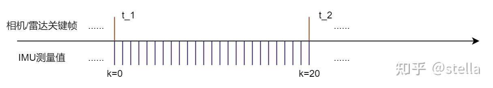

# 惯性测量单元介绍及其预积分

## 1. 惯性测量单元 IMU 介绍
IMU中文名叫惯性测量单元，英文名：**Inertial measurement unit**，简称 **IMU**。简单理解就是这个传感器可以测量两个东西，加速度a是沿三个轴方向的线加速度，而角速度w就是这三个方向的角速度,还有就是IMU的频率比较高一般都在100HZ以上。在IMU内部，除了通常的**白噪声**，还有个特别的量零偏**bias**，在这是传感器内部机械、温度等各种物理因素产生的传感器内部误差的综合参数。IMU的加速度计和陀螺仪的每个轴都用彼此相互独立的参数建模，所以关于IMU的输出建模方式为
$$
a = R_{bw}^{} (a_{t}-g)+b_{a}+n_{a} \\
w = w_{t} + b_{w} + n_{w}
$$即输出的加速度计和陀螺仪的数据受零偏以及高斯白噪声的影响，因此，紧耦合的LIO 或者 VIO 都会实时估计 IMU 的零偏，以实现 IMU 数据的最大利用率。

## 2.IMU状态的连续表达形式（PQV）
IMU 可以获得当前时刻的角速度和加速度值，通过该值可以对系统状态（位置，速度，姿态）进行推算，对激光K关键帧和k+1关键帧之间所有的IMU进行积分，对应的IMU坐标系为$b_{k}$和$b_{k+1}$，根据k时刻的数据，积分求得k+1时刻的数据，求出的是在世界坐标系下的值：
$$
P_{b_{k+1}}^{w} = P_{b_{k}}^{w} + v_{b_{k}}^{w}\Delta t_{k} + \iint (R_{t}^{w}(a_{t}-b_{at}-n_{a})-g_{}^{w})dt_{}^{2}\\
v_{b_{k+1}}^{w} = v_{b_{k}}^{w}  + \int (R_{t}^{w}(a_{t}-b_{at}-n_{a})-g_{}^{w})dt\\
q_{b_{k+1}}^{w} = q_{b_{k}}^{w} \otimes  \int (\frac{1}{2}\Omega  (w_{t}-b_{wt}-n_{w})-g_{t}^{bk})dt
$$
其中
$$
\Omega _{(w)} = \begin{vmatrix}
  -\left \lfloor w \right \rfloor \times &w \\
  -w_{}^{T}& 0
\end{vmatrix} \\
\left \lfloor w \right \rfloor \times  = \begin{vmatrix}
 0 & -w_{z} & w_{y}\\
 w_{z} & 0 & -w_{x}\\
 -w_{y} & w_{x} & 0
\end{vmatrix}
$$

## 3. 为什么要做IMU的预积分
我们从IMU中拿到的数据包含角速度和加速度两部分，一般的低成本imu的读数都是基于IMU坐标系。根据imu的误差模型我们可以假设：角速度读数会在真实值的基础上受到bias和白噪声的影响，加速度除了受到bias和噪声的影响，还会受到重力的影响。我们知道角速度积分得到姿态，加速度积分得到速度，速度积分得到位移。在此过程中会逐渐累积噪声，因此我们可以利用相机或激光的位姿估计结果来估计出IMU的bias，并优化位姿、速度的估计值。 由于相机或激光的频率是明显低于IMU的采样频率的，而在SLAM中我们通常是求解各个关键帧的相机或雷达的位姿，因此需要对两帧图像/激光之间的IMU观测进行累加。

在这个过程中，我们需要解决一个问题：每次拿到IMU数据，更新速度的时候，会受到姿态的影响（因为朝向不同，速度方向就不一样），因此更新速度前需要知道该时刻的姿态，在更新平移时，需要每个IMU时刻速度和旋转。我们在构建优化问题时，会将相机或激光关键帧的pvq（位置、速度、旋转）以及imu bias作为状态量进行优化。在求解优化问题时，会不断迭代更新这些状态量。所以，我们在求解优化问题的过程中每迭代一次，更新了一下关键帧的位姿、速度和IMU bias，就需要重复一次积分操作，要知道我们在优化的时候不止迭代一次的，这样就会花费大量的时间重新积分，显然是不太合适的。

IMU预积分的思路就是先把每次优化迭代时不变的项提出来，减小每次重新积分的工作量。

## 4. IMU如何预积分

参考上一节连续时间 IMU 积分的公式，等号两边同时乘上$R_{w}^{b_{k}}$即可，即
$$
R_{w}^{b_{k}}p_{b_{k+1}}^{w} = R_{w}^{b_{k}}(p_{b_{k}}^{w}+v_{b_{k}}^{w}\Delta t_{k}-\frac{1}{2}g_{}^{w}\Delta t_{k}^{2})+a_{b_{k+1}}^{b_{k}} \\
R_{w}^{b_{k}}v_{b_{k+1}}^{w} = R_{w}^{b_{k}}(v_{b_{k}}^{w}-g_{}^{w}\Delta t_{k}^{})+\beta _{b_{k+1}}^{b_{k}}\\
q_{w}^{b_{k}}\otimes q_{b_{k+1}}^{w} = \gamma _{b_{k+1}}^{b_{k}}
$$  
上面三个变量即预积分量，我们可以发现这三个预积分量都和 k 时刻或 k+1 时刻状态无关，因此当 k 时刻状态发生变化时，我们不需要将 IMU 的数据重新积分。

具体参考链接:
1. https://blog.csdn.net/tfb760/article/details/129008663
2. https://zhuanlan.zhihu.com/p/563177244

